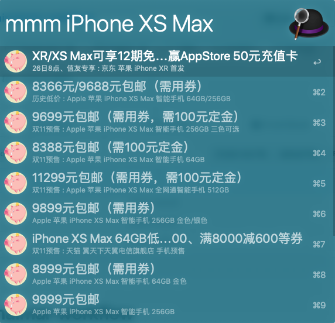

# alfred-maimaimai-workflow

### 少废话，先看东西

### 功能

输入关键字自动到多个优惠网站去搜索商品信息。

### 下载

#### [Realease](https://github.com/h2oiswater/alfred-maimaimai-workflow/releases)页面下载

### To do

- [x] 初版 2018-10-25

- [ ] 支持更多资讯网站检索聚合

     - [x] [买个便宜货](https://www.mgpyh.com/) 2018-10-26

     - [ ] [今日聚超值](https://best.pconline.com.cn/)

- [ ] 检索结果的排序优化

- [ ] 新增根据关系以及节日推荐礼品

### 信息说明

1. 目前优惠信息来自我心目中最好的导购网站[什么值得买](https://www.smzdm.com/)及其他导购网站。

2. logo来自阿里“爸爸“的图片素材网站[iconfont](http://iconfont.cn) 的设计师[panxinghua](http://iconfont.cn/user/detail?spm=a313x.7781069.0.d214f71f6&uid=1010000)的作品。

该项目仅供个人学习使用，信息来源，logo侵权立删。
